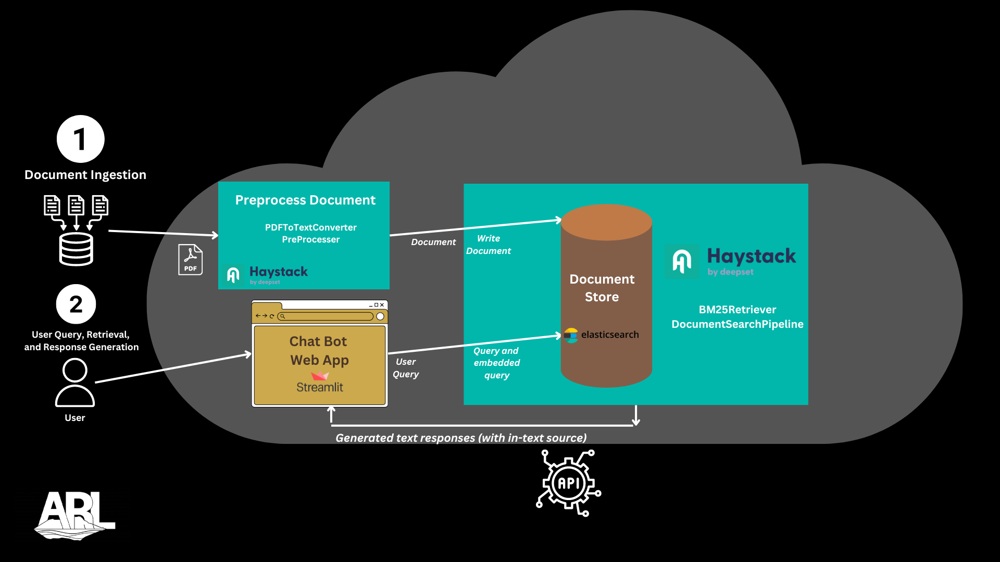

# Knowledge Base Search
Retrieval Augmented Generation (RAG) is an approach that combines both retrieval and generation techniques in AI language processing models


## Goal
Implement a search system that allows users to quickly find information within a knowledge base. This is helpful for large volumes of local text data to work with in order to find more centered, targeted answers. For example, a collection of books, documents, and (potentially in the future) videos that you want to be able to interact with using a chatbot.

## Installation 
Run these commands to install and run this app
```
docker pull docker.elastic.co/elasticsearch/elasticsearch:8.14.3
```
```
docker network create mynetwork
```
```
docker run -d --name elasticsearch --network mynetwork -p 9200:9200 -e "discovery.type=single-node" -e "xpack.security.enabled=false" -e "xpack.security.transport.ssl.enabled=false" -e "ELASTIC_PASSWORD=testpassword" docker.elastic.co/elasticsearch/elasticsearch:8.14.3

```
```
cd Docker
```
```
docker build -t streamlit-app . --network host
```
```
docker run -d -p 8501:8501 --name streamlit-app --network mynetwork -e ELASTIC_PASSWORD=testpassword streamlit-app
```
See app on localhost:8501

# Tools

## [Haystack](https://haystack.deepset.ai/overview/intro) 
Haystack by Deepset is an open-source framework for building production-ready *LLM applications*, RAG *pipelines* and *state-of-the-art search systems* that work intelligently over large document collections. It lets you quickly try out the latest AI models while being flexible and easy to use.

Some examples of what you can build include:

- **Advanced RAG** on your own data source, powered by the latest retrieval and generation techniques.
- **Chatbots and agents** powered by cutting-edge generative models like GPT-4, that can even call external functions and services.
- **Generative multi-modal question answering** on a knowledge base containing mixed types of information: images, text, audio, and tables.
- **Information extraction**from documents to populate your database or build a knowledge graph.


## [Elasticsearch](https://www.elastic.co/guide/en/elasticsearch/reference/current/elasticsearch-intro.html) 
A distributed search and analytics engine designed for fast and efficient data retrieval and analysis. In this project we will be using it as a vector database to create, store, and search vector embeddings. 

## [Streamlit](https://www.geeksforgeeks.org/a-beginners-guide-to-streamlit/)
We have a lot of options in python for deploying our model. Some popular frameworks are Flask and Django. But the issue with using these frameworks is that we should have some knowledge of HTML, CSS, and JavaScript. Using streamlit you can deploy any machine learning model and any python project with ease and without worrying about the frontend. Streamlit is very user-friendly. 

## [Docker](https://docs.docker.com/guides/docker-overview/)
Docker is a platform for developing, shipping, and running applications. It allows you to separate your applications from your infrastructure in order to deliver software quickly. In my opinion, it is one of the most important tools in software engineering. 

# Future Considerations
Kibana is used for data visualization and it works well with elasticsearch. It allows users to create dashbords and perform data exploration. I could see it being used in the future with this app or similar ones. 